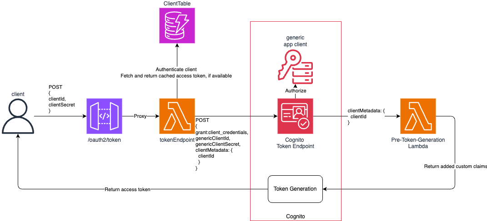

# Cognito cost optimization

This project holds resources to manage AWS Cognito costs.

**Proof of Concept - Not production ready!**

# Architecture

# Cognito token caching

# Reducing app client costs by using self-managed app clients

This project provides a solution to reduce AWS Cognito app client costs by using self-managed app clients. The solution is based on the following:

- [x] Use a single Cognito user pool for all app clients.

Current features:

- [x] Provide our own authentication layer to avoid Cognito app client costs.
- [x] Issue Cognito issued JWT tokens for our self-managed app clients using additional claims.

## Note

This token uses a generic client to issue tokens. This means that client_id will remain constant for all issued tokens, which might or might not be an issue.

## Benefits

- Almost eliminated all Cognito app client costs.
- Almost full Cognito compatibility.

## Drawbacks

- We need to manage our own authentication layer.
- Issued tokens client_id claim will not represent the client that requested the token. This might have implications in using these tokens in other AWS services.

# This that can be further improved

- [ ] Provide a way to bypass authentication layer and use normal Cognito app clients for specific clients. (For clients that must have 100% 100% Cognito token compatibility)
